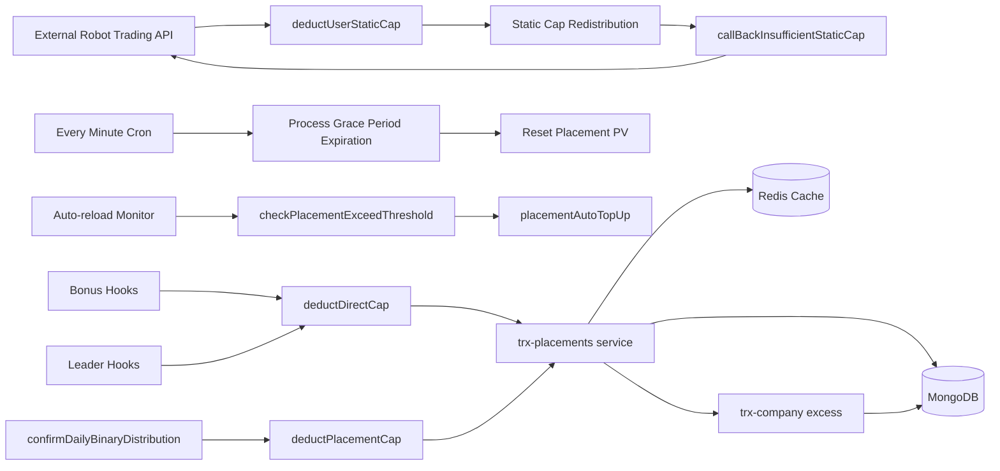
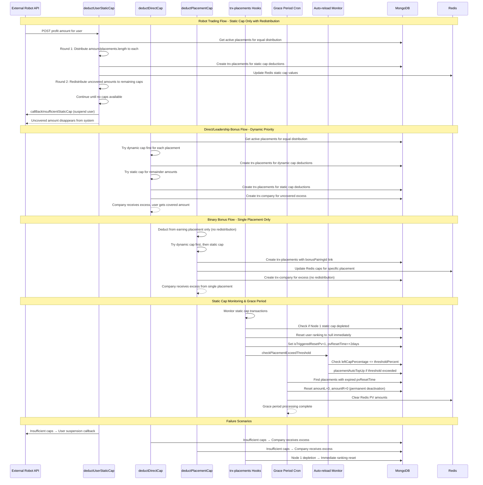

## Overview

The cap deduction system manages earning limits through Static Caps and Dynamic Caps with different deduction strategies per earning type. Robot trading profits use static-only caps with redistribution, while reward bonuses prioritize dynamic caps and send excess to company. The system handles automatic ranking resets, grace periods, and auto-reload functionality.

## System Architecture



## Technical Implementation Flow

### Step 1 – Robot Trading Static Cap Distribution with Redistribution

**Goal**: Distribute robot trading profits equally across active placements using only static caps with multi-round redistribution
**Inputs → Outputs**: External robot profit amount → Equal distribution with static cap redistribution → User suspension if insufficient

**Key Conditions/Rules**:

- Static cap only (`useStaticOnly = true` in `deductPlacementCap`)
- Equal distribution: `amount / activePlacements.length`
- Multi-round redistribution until no placement can accept more
- User suspension callback if final balance remains
- Excess amounts disappear (don't go to company)

**Primary Code Path**`user.js > deductUserStaticCap(userId, amount, sourceId, sourceType, clientId, extraData)`

```jsx
// Called by external robot trading API to distribute profits using static caps only
async function deductUserStaticCap(
  userId,
  amount,
  sourceId,
  sourceType,
  clientId,
  extraData,
) {
  const app = require("../app");
  let activePlacements = await app.service("placements").Model.find({
    userId,
  });
  activePlacements = filter(activePlacements, (placement) => {
    return get(placement, "rankingId"); // Only active placements with ranking
  });

  if (isEmpty(activePlacements)) {
    // No active placements - trigger suspension callback
    let user = await app
      .service("users")
      .Model.findOne({
        _id: ObjectId(userId),
      })
      .lean();
    callBackInsufficientStaticCap(user);
    throwErrorInfo(
      errorTypes.notAcceptable.code,
      `User ${userId} don't have active placements`,
    );
  }

  let totalBalance = 0;
  let avgAmount = toNumber(amount) / activePlacements.length; // Equal distribution

  // First round: distribute equally to all active placements
  if (avgAmount > 0) {
    for (let index = 0; index < activePlacements.length; index++) {
      const placement = activePlacements[index];
      let result = await deductPlacementCap(
        placement.username,
        avgAmount,
        placement._id,
        sourceId,
        sourceType,
        true,
        clientId,
        extraData,
      ); // useStaticOnly = true
      totalBalance += result.balance; // Track uncovered amounts
    }
  }

  totalBalance = round(totalBalance, 4);

  // Second round: redistribute uncovered amounts to placements with remaining caps
  if (totalBalance > 0) {
    for (let index = 0; index < activePlacements.length; index++) {
      if (totalBalance > 0) {
        const placement = activePlacements[index];
        let result = await deductPlacementCap(
          placement.username,
          totalBalance,
          placement._id,
          sourceId,
          sourceType,
          true,
          clientId,
          extraData,
        );
        totalBalance = result.balance;
      }
    }
    totalBalance = round(totalBalance, 4);
  }

  // Final uncovered amount - user suspension (amount disappears)
  if (totalBalance > 0) {
    let user = await app
      .service("users")
      .Model.findOne({
        _id: ObjectId(userId),
      })
      .lean();
    callBackInsufficientStaticCap(user); // Triggers robot trading suspension
  }
}
```

**Side Effects**: trx-placements static cap deductions, user suspension callbacks, Redis cap updates
**Observability**: User suspension callbacks for insufficient caps
**Failure notes**: Excess amounts disappear via suspension callback, no company transaction created

### Step 2 – Direct Reward Dynamic-Priority Cap Deduction

**Goal**: Deduct direct/leadership bonuses using dynamic cap first, then static cap, with company receiving excess
**Inputs → Outputs**: Bonus amount from hooks → Dynamic then static cap deduction → Company excess if insufficient → User wallet credit

**Key Conditions/Rules**:

- Dynamic cap priority via `getPlacementAvailableCap()` logic
- Equal distribution across active placements with ranking
- Company receives uncovered excess amounts
- User gets wallet credit for successfully deducted amounts

**Primary Code Path** `user.js > deductDirectCap(userId, amount, sourceId, sourceType, extraData)`

```jsx
// Called from bonus.hooks.js and bonusleaders.hooks.js for direct/leadership rewards
async function deductDirectCap(
  userId,
  amount,
  sourceId,
  sourceType,
  extraData,
) {
  const app = require("../app");
  let activePlacements = await app.service("placements").Model.find({
    userId,
  });
  activePlacements = filter(activePlacements, (placement) => {
    return get(placement, "rankingId"); // Only placements with ranking
  });
  activePlacements = sortBy(activePlacements, ["node"]); // Sort by node order

  let totalBalance = 0;
  let avgAmount = toNumber(amount) / activePlacements.length; // Equal distribution

  // First round: distribute equally to all active placements
  if (avgAmount > 0) {
    for (let index = 0; index < activePlacements.length; index++) {
      const placement = activePlacements[index];
      let result = await deductPlacementCap(
        placement.username,
        avgAmount,
        placement._id,
        sourceId,
        sourceType,
        false,
        null,
        extraData,
      ); // useStaticOnly = false (dynamic priority)
      totalBalance += result.balance;
    }
  }

  totalBalance = round(totalBalance, 4);

  // Second round: redistribute uncovered amounts
  if (totalBalance > 0) {
    for (let index = 0; index < activePlacements.length; index++) {
      if (totalBalance > 0) {
        const placement = activePlacements[index];
        let result = await deductPlacementCap(
          placement.username,
          totalBalance,
          placement._id,
          sourceId,
          sourceType,
          false,
          null,
          extraData,
        );
        totalBalance = result.balance;
      }
    }

    totalBalance = round(totalBalance, 4);

    // Company receives final uncovered amount
    if (totalBalance > 0) {
      app.service("trx-company").create({
        ...extraData,
        [placementTransactionForeignKey[sourceType]]: sourceId,
        sourceType: sourceType,
        trxType: "IN",
        amount: totalBalance,
        origAmount: amount,
        userId,
        amountType:
          sourceType == placementTransactionSourceTypes.bonus
            ? companyAmountType.insufficientDeductDirectBonus
            : placementTransactionSourceTypes.bonusLeader
              ? companyAmountType.insufficientDeductLeaderBonus
              : null,
      });
    }
  }

  let distributedAmount = amount - totalBalance; // Amount actually deducted from caps

  // User receives wallet credit for successfully deducted amount
  await app.service("trx-users").create({
    ...extraData,
    userId: userId,
    sourceType: sourceType,
    [placementTransactionForeignKey[sourceType]]: sourceId,
    trxType: "IN",
    amountType: amountTypes.wallet,
    amount: distributedAmount,
  });
}
```

**Side Effects**: trx-placements cap deductions, trx-company excess records, trx-users wallet credits, Redis cap updates
**Observability**: Company excess transactions for uncovered amounts
**Failure notes**: Insufficient caps result in company receiving excess, user gets partial wallet credit

### Step 3 – Binary Bonus Placement-Specific Cap Deduction

**Goal**: Deduct binary bonuses from specific earning placement only using dynamic-then-static priority
**Inputs → Outputs**: Binary bonus from confirmDailyBinaryDistribution → Single placement cap deduction via `deductPlacementCap`

**Key Conditions/Rules**:

- Single placement only (called directly for specific placement)
- Dynamic cap first, then static cap via `getPlacementAvailableCap()`
- No redistribution to other placements
- Company receives insufficient amounts via binary confirmation process

**Primary Code Path** `user.js > deductPlacementCap(username, amount, placementId, sourceId, sourceType, useStaticOnly, clientId, extraData)`

```jsx
// Called from confirmDailyBinaryDistribution for placement-specific binary bonuses
async function deductPlacementCap(
  username,
  amount,
  placementId,
  sourceId,
  sourceType,
  useStaticOnly = false,
  clientId,
  extraData,
) {
  const app = require("../app");

  // Get available caps using actual getPlacementAvailableCap function
  let availableDeduct = await getPlacementAvailableCap(
    username,
    amount,
    useStaticOnly,
  );
  let balance = amount;

  // Deduct from dynamic cap first (if not useStaticOnly)
  if (availableDeduct.dynamicCapDeduct > 0) {
    await app.service("trx-placements").create({
      ...extraData,
      placementId: placementId,
      sourceType: sourceType,
      [placementTransactionForeignKey[sourceType]]: sourceId, // Links to bonusPairingId for binary bonuses
      trxType: "OUT",
      amount: availableDeduct.dynamicCapDeduct,
      amountType: amountTypes.dynamicCap,
    });
    balance -= availableDeduct.dynamicCapDeduct;
  }

  // Deduct remainder from static cap
  if (availableDeduct.staticCapDeduct > 0) {
    await app.service("trx-placements").create({
      ...extraData,
      placementId: placementId,
      sourceType: sourceType,
      [placementTransactionForeignKey[sourceType]]: sourceId,
      trxType: "OUT",
      amount: availableDeduct.staticCapDeduct,
      amountType: amountTypes.staticCap,
      clientId,
    });
    balance -= availableDeduct.staticCapDeduct;
  }

  return {
    amount,
    dynamicCapDeduct: availableDeduct.dynamicCapDeduct,
    staticCapDeduct: availableDeduct.staticCapDeduct,
    balance, // Remaining uncovered amount
  };
}
```

**Secondary Calls**`suser.js > getPlacementAvailableCap(username, amount, useStaticOnly)`

```jsx
// Core cap availability calculation using Redis values
async function getPlacementAvailableCap(
  username,
  amount,
  useStaticOnly = false,
) {
  let dynamicCapDeduct = 0;
  let staticCapDeduct = 0;

  if (amount > 0) {
    // Get cap values from Redis
    let staticCap = toNumber(await redisClient.hGet(username, "staticCap"));
    let dynamicCap = toNumber(await redisClient.hGet(username, "dynamicCap"));
    let usedStaticCap = toNumber(
      await redisClient.hGet(username, "usedStaticCap"),
    );
    let usedDynamicCap = toNumber(
      await redisClient.hGet(username, "usedDynamicCap"),
    );

    // Calculate available caps
    let availableDynamicCap =
      dynamicCap - usedDynamicCap > 0 ? dynamicCap - usedDynamicCap : 0;
    let availableStaticCap =
      staticCap - usedStaticCap > 0 ? staticCap - usedStaticCap : 0;

    // Priority 1: Dynamic cap (unless useStaticOnly)
    dynamicCapDeduct =
      amount >= availableDynamicCap ? availableDynamicCap : amount;
    if (useStaticOnly) {
      dynamicCapDeduct = 0; // Robot trading ignores dynamic cap
    }
    amount -= dynamicCapDeduct;

    // Priority 2: Static cap for remainder
    if (amount > 0) {
      staticCapDeduct =
        amount >= availableStaticCap ? availableStaticCap : amount;
    }
  }

  return {
    amount, // Remaining uncovered amount
    dynamicCapDeduct,
    staticCapDeduct,
  };
}
```

**Side Effects**: trx-placements dynamic/static cap deductions, Redis cap updates, balance tracking for excess handling
**Observability**: Balance amounts returned for company excess processing
**Failure notes**: Uncovered balance handled by calling function (binary confirmation creates company transaction)

## Sequence Diagram


